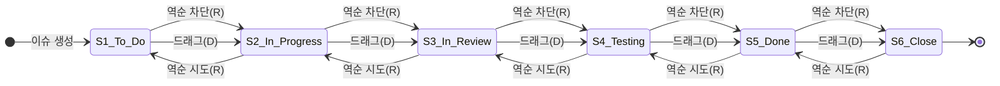

## 테스트 항목 칸반보드 상태전이 테스팅 test_kanban.py
 
## 테스트 베이시스

칸반보드 이슈 변경 테스트 항목의 테스트 베이시스는 다음과 같다.

칸반보드엔 To Do, In Progress, In Review, Testing, Done, Close 칼럼이 존재하고 등록한 이슈가 카드로 존재한다.

이슈는 생성시 항상 To Do 칼럼에서 시작한다.

드래그 엔 드롭 기능으로 To Do -> In Progress -> In Review -> Testing -> Done -> Close로 이동 가능하지만 역순,단계 건너뛰기는 안된다.

칼럼을 옮길때마다 카드의 상태는 칼럼명과 동일하게 변경된다.

---
## 스텝 1 :기능 세트 식별(TD1)

FS1:칸반보드 이슈 변경

---
## 스텝 2 : 테스트 컨디션 도출(TD2)

### 상태전이 다이어그램 

---
## 스텝 3 : 테스트 커버리지 항목 도출 - 0-스위치 및 모든 전이 테스팅(TD3)

### 상태 이벤트 표 & 테스트 케이스 매핑

|  | 드래그(D) | 역순(R) |
|---|---|---|
| S1 | S2 / D (TC COVER1) | - / - |
| S2 | S3 / D (TC COVER2) | S2 / - (TC COVER3) |
| S3 | S4 / D (TC COVER4) | S3 / - (TC COVER5) |
| S4 | S5 / D (TC COVER6) | S4 / - (TC COVER7) |
| S5 | S6 / D (TC COVER8) | S5 / - (TC COVER9) |
| S6 | - / -  | S6 / - (TC COVER10) |

---
TC COVER1 : S1->S2(입력값 : D) (FS1, 유효 전이)

TC COVER2 : S2->S3(입력값 : D) (FS1, 유효 전이)

TC COVER3 : S2->S2(입력값 ->S1 : R) (FS1, 비유효 전이)

TC COVER4 : S3->S4(입력값 : D) (FS1, 유효 전이)

TC COVER5 : S3->S3(입력값 ->S2 : R) (FS1, 비유효 전이)

TC COVER6 : S4->S5(입력값 : D) (FS1, 유효 전이)

TC COVER7 : S4->S4(입력값 ->S3 : R) (FS1, 비유효 전이)

TC COVER8 : S5->S6(입력값 : D) (FS1, 유효 전이)

TC COVER9 : S5->S5(입력값 ->S4 : R) (FS1, 비유효 전이)

TC COVER10 : S6->S6(입력값 ->S5 : R) (FS1, 비유효 전이)

TC COVER11 : S1->S1(입력값 : ->S3 D) (FS1, 비유효 전이) 

TC COVER12 : S1->S1(입력값 : ->S6 D) (FS1, 비유효 전이)

## 스텝 4 : 유효 테스트 케이스 도출(TD4)

### 0-스위치 테스트 케이스 도출(유효 전이)

| 테스트 케이스 | 1 | 2 | 3 | 4 | 5 |
|---|---|---|---|---|---|
| 시작 상태 | S1 | S2 | S3 | S4 | S5 |
| 입력 | D | D | D | D | D |
| 기대 결과 | S2 | S3 | S4 | S5 | S6 |
| 종료 상태 | S2 | S3 | S4 | S5 | S6 |
| 테스트 커버리지 항목 | TC COVER1 | TC COVER2 | TC COVER4 | TC COVER6 | TC COVER8 |

### 테스트 케이스 도출(비유효 전이)

| 테스트 케이스 | 6 | 7 | 8 | 9 | 10 | 11 | 12 |
|---|---|---|---|---|---|---|---|
| 시작 상태 | S2 | S3 | S4 | S5 | S6 | S1 | S1 |
| 입력 | ->S1/R | ->S2/R | ->S3/R | ->S4/R |  ->S5/R | ->S3/D | ->S6/D |
| 기대 결과 | S2 | S3 | S4 | S5 | S6 | S1 | S1 |
| 종료 상태 | S2 | S3 | S4 | S5 | S6 | S1 | S1 |
| 테스트 커버리지 항목 | TC COVER3 | TC COVER5 | TC COVER7 | TC COVER9 | TC COVER10 | TC COVER11 | TC COVER12 |

---
### 테스트 커버리지 항목 도출 - 1-스위치 테스팅(TD3)

TC COVER13 : S1->S2->S3(입력값 : D, D) (FS1, 유효 전이)

TC COVER14 : S2->S3->S4(입력값 : D, D) (FS1, 유효 전이)

TC COVER15 : S3->S4->S5(입력값 : D, D) (FS1, 유효 전이)

TC COVER16 : S4->S5->S6(입력값 : D, D) (FS1, 유효 전이)

TC COVER17 : S1->S2->S2(입력값 ->S1 : D, R) (FS1, 비유효 전이)

TC COVER18 : S2->S3->S3(입력값 ->S2 : D, R) (FS1, 비유효 전이)

TC COVER19 : S3->S4->S4(입력값 ->S3 : D, R) (FS1, 비유효 전이)

TC COVER20 : S4->S5->S5(입력값 ->S4 : D, R) (FS1, 비유효 전이)

TC COVER21 : S5->S6->S6(입력값 ->S5 : D, R) (FS1, 비유효 전이)

---
### 1-스위치 테스트 케이스 도출(TD4)

| 테스트 케이스 | 13 | 14 | 15 | 16 | 17 |
|---|---|---|---|---|---|
| 시작 상태 | S1 | S2 | S3 | S4 | S1 |
| 입력 | D | D | D | D | D |
| 기대 결과 | S2 | S3 | S4 | S5 | S2 |
| 다음 상태 | S2 | S3 | S4 | S5 | S2 |
| 입력 | D | D | D | D | ->S1/R |
| 기대 결과 | S3 | S4 | S5 | S6 | S2 |
| 종료 상태 | S3 | S4 | S5 | S6 | S2 |
| 테스트 커버리지 항목 | TC COVER13 | TC COVER14 | TC COVER15 | TC COVER16 | TC COVER17 |

| 테스트 케이스 | 18 | 19 | 20 | 21 |
|---|---|---|---|---|
| 시작 상태 | S2 | S3 | S4 | S5 |
| 입력 | D | D | D | D |
| 기대 결과 | S3 | S4 | S5 | S6 |
| 다음 상태 | S3 | S4 | S5 | S6 |
| 입력 | ->S2/R | ->S3/R | ->S4/R | ->S5/R |
| 기대 결과 | S3 | S4 | S5 | S6 |
| 종료 상태 | S3 | S4 | S5 | S6 |
| 테스트 커버리지 항목 | TC COVER18 | TC COVER19 | TC COVER20 | TC COVER21 |

---
### 동등분할 & 경계값 분석
전체 이동 경우의 수 = { -5, -4, -3, -2, -1, 0, +1, +2, +3, +4, +5 }

{ +1 } = TC1, 2, 3, 4, 5

{ -1 } = TC6, 7, 8, 9, 10

{ -2, -3, -4, -5, +2, +3, +4, +5 }

동등분할 { -2, -3, -4, -5 } == { +2, +3, +4, +5 }

최소 경계값 { +2 } = TC11

최대 경계값 { +5 } = TC12

## 스텝 5 : 테스트 케이스 세트(TD5)

TS1 : 0-스위치 테스트 케이스 
- 1, 2, 3, 4, 5, 6, 7, 8, 9, 10, 11, 12

TS2 : 모든 전이 테스트 케이스
- 1, 2, 3, 4, 5, 6, 7, 8, 9, 10

TS3 : 1-스위치 테스트 케이스
- 13, 14, 15, 16, 17, 18, 19, 20, 21

## 스텝 6 : 테스트 절차 도출(TD6)
TS1과 TS3의 모든 테스트 케이스를 테스트 세트 내의 지정된 순서대로 수행
### 상태 전이 테스팅 커버리지

커버리지(0-스위치 커버리지) = 12/12 * 100% = 100%

커버리지(1-스위치 커버리지) = 9/9 * 100 % = 100%

