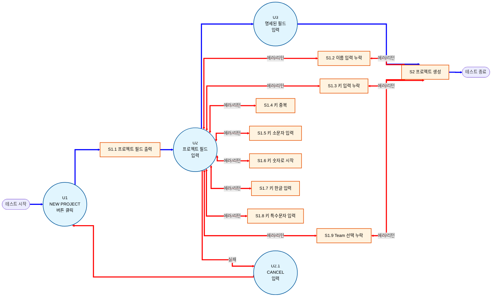

## 시나리오 테스트 명세 

> **테스트 항목:** ERP 기능 내 프로젝트 생성 시나리오 (tests/playwright/test_project.py)

### 1. 테스트 베이시스 

ERP 일부 기능인 프로젝트 생성 이라는 테스트 항목이 있고 테스트 베이시스는 다음과 같다.

프로젝트 생성 기능은 사용자가 관리할 프로젝트를 생성하도록 해 준다.

프로젝트 생성은 프로젝트 필드에서 프로젝트 생성 버튼을 누른 뒤 프로젝트 필드 칸을 채운다.

프로젝트 필드로는 프로젝트 이름,프로젝트 키,프로젝트 설명, 상태,팀,시작-종료일,배포 URL을 설정할 수 있다.

프로젝트를 생성하면 DB에 저장되 등록된 팀은 프로젝트를 관리할 수 있다.

####  시나리오 분류
* **일반적 시나리오 Happy Path** 프로젝트 정상 생성
* **대체 시나리오 Exception Path** - 프로젝트 생성 실패
  - 프로젝트 이름 누락
  - 프로젝트 키 누락
  - 중복된 프로젝트 키
  - 프로젝트 키 소문자 입력
  - 프로젝트 키 숫자로 시작
  - 프로젝트 키 한글 입력
  - 프로젝트 키 특수문자 입력
  - 팀 선택 누락

---

### 2. 테스트 설계 스텝

#### 🔹 Step 1 : 기능 세트 식별 (TD1)
* **FS1** = 프로젝트 생성 기능

#### 🔹 Step 2 : 테스트 컨디션 도출 (TD2)
아래는 프로젝트 생성 기능의 이벤트 흐름 다이어그램입니다. 성공 흐름은 파란색 선으로, 오류 및 실패 흐름은 빨간색 선으로 표시됩니다.

## 3. 테스트 컨디션

- TC COND1 : 프로젝트 생성 성공(U1,S1.1,U2,U3,S2)

- TC COND2 : 프로젝트 이름 누락(U1,S1.1,U2,S1.2)

- TC COND3 : 프로젝트 키 누락(U1,S1.1,U2,S1.3)

- TC COND4 : 프로젝트 키 중복(U1,S1.1,U2,S1.4)

- TC COND5 : 프로젝트 키 소문자 입력(U1,S1.1,U2,S1.5)

- TC COND6 : 프로젝트 키 숫자로 시작(U1,S1.1,U2,S1.6)

- TC COND7 : 프로젝트 키 한글 입력(U1,S1.1,U2,S1.7)

- TC COND8 : 프로젝트 키 특수문자 입력(U1,S1.1,U2,S1.8)

- TC COND9 : 팀 선택 누락(U1,S1.1,U2,S1.9)

- TC COND10 : CANCEL 선택(U1,S1.1,U2,U2.1)

---
#### 🔹 step 3 : 테스트 커버리지 항목 도출(TD3)

- TC COVER1 = TC COND1

- TC COVER2 = TC COND2

- TC COVER3 = TC COND3

- TC COVER4 = TC COND4

- TC COVER5 = TC COND5

- TC COVER6 = TC COND6

- TC COVER7 = TC COND7

- TC COVER8 = TC COND8

- TC COVER9 = TC COND9

- TC COVER10 = TC COND10
---
#### 🔹 step 4 : 테스트 케이스 도출(TD4)

시나리오 테스팅 케이스

| 항목 | 내용 |
| :--- | :--- |
| **테스트 케이스 #** | 1 |
| **테스트 케이스 명** | 프로젝트 생성 성공 |
| **수행할 시나리오 경로** | U1, S1.1, U2, U3, S2 |
| **입력** | -NEW PROJECT 클릭 -프로젝트 필드 값 입력 -CREATE 클릭  |
| **사전 조건** | 유효한 사용자가 로그인한 상태여야 프로젝트 생성이 가능하다. |
| **기대 결과** | -프로젝트 목록 페이지(#/projects)에 생성한 프로젝트 보임  -생성된 프로젝트에 입력한 정보 일치 |
| **테스트 커버리지 항목** | TC COVER1 |

| 항목 | 내용 |
| :--- | :--- |
| **테스트 케이스 #** | 2 |
| **테스트 케이스 명** | 프로젝트 이름 누락 |
| **수행할 시나리오 경로** | U1, S1.1, U2, S1.2 |
| **입력** | -프로젝트 생성 필드가 열려있는 상태로 가정 -프로젝트 키,Team 필드값은 입력 되어있다고 가정 -프로젝트 이름 * 필드값이 비어있는 상태로 CREATE 클릭  |
| **사전 조건** | 유효한 사용자가 로그인한 상태여야 프로젝트 생성이 가능하다. 프로젝트 키는 중복된 값이 아니어야 한다. |
| **기대 결과** | -프로젝트 이름 필드가 선택되며 "프로젝트 이름은 필수입니다" 경고 메세지 출력  |
| **테스트 커버리지 항목** | TC COVER2 |

| 항목 | 내용 |
| :--- | :--- |
| **테스트 케이스 #** | 3 |
| **테스트 케이스 명** | 프로젝트 키 누락 |
| **수행할 시나리오 경로** | U1, S1.1, U2, S1.3 |
| **입력** | -프로젝트 생성 필드가 열려있는 상태로 가정 -프로젝트 이름,Team 필드값은 입력 되어있다고 가정 -프로젝트 키 * 필드값이 비어있는 상태로 CREATE 클릭  |
| **사전 조건** | 유효한 사용자가 로그인한 상태여야 프로젝트 생성이 가능하다. |
| **기대 결과** | -프로젝트 키 필드가 선택되며 "프로젝트 키는 필수입니다" 경고 메세지 출력  |
| **테스트 커버리지 항목** | TC COVER3 |

| 항목 | 내용 |
| :--- | :--- |
| **테스트 케이스 #** | 4 |
| **테스트 케이스 명** | 프로젝트 키 중복 |
| **수행할 시나리오 경로** | U1, S1.1, U2, S1.4 |
| **입력** | -프로젝트 생성 필드가 열려있는 상태로 가정 -프로젝트 이름,Team 필드값은 입력 되어있다고 가정 -프로젝트 키 * 필드값에 "TEST"입력후 CREATE 클릭  |
| **사전 조건** | 유효한 사용자가 로그인한 상태여야 프로젝트 생성이 가능하다. 사전에 "TEST" 키 값을 가지고 있는 프로젝트가 생성되어 있어야 한다. |
| **기대 결과** | -상단 중앙에 "Fauled to create project", 우측 상단에 잘못된 요청입니다 "Project with key 'TEST' already exists" 토스트 메세지 출력 |
| **테스트 커버리지 항목** | TC COVER4 |

| 항목 | 내용 |
| :--- | :--- |
| **테스트 케이스 #** | 5 |
| **테스트 케이스 명** | 프로젝트 키 소문자 입력 |
| **수행할 시나리오 경로** | U1, S1.1, U2, S1.5 |
| **입력** | -프로젝트 생성 필드가 열려있는 상태로 가정 -프로젝트 이름,Team 필드값은 입력 되어있다고 가정 -프로젝트 키 * 필드값에 소문자 입력후 CREATE 클릭  |
| **사전 조건** | 유효한 사용자가 로그인한 상태여야 프로젝트 생성이 가능하다. 프로젝트 키 필드 아래 "대문자로 시작, 대문자와 숫자만 가능 (예: PROJ1, DEV)"이 명시되어 있다. |
| **기대 결과** | -프로젝트 키 필드가 선택되며 "대문자로 시작하고 대문자와 숫자만 사용 가능합니다" 경고 메세지 출력  |
| **테스트 커버리지 항목** | TC COVER5 |

| 항목 | 내용 |
| :--- | :--- |
| **테스트 케이스 #** | 6 |
| **테스트 케이스 명** | 프로젝트 키 숫자로 시작 |
| **수행할 시나리오 경로** | U1, S1.1, U2, S1.6 |
| **입력** | -프로젝트 생성 필드가 열려있는 상태로 가정 -프로젝트 이름,Team 필드값은 입력 되어있다고 가정 -프로젝트 키 * 필드값에 숫자 입력후 CREATE 클릭  |
| **사전 조건** | 유효한 사용자가 로그인한 상태여야 프로젝트 생성이 가능하다. 프로젝트 키 필드 아래 "대문자로 시작, 대문자와 숫자만 가능 (예: PROJ1, DEV)"이 명시되어 있다. |
| **기대 결과** | -프로젝트 키 필드가 선택되며 "대문자로 시작하고 대문자와 숫자만 사용 가능합니다" 경고 메세지 출력  |
| **테스트 커버리지 항목** | TC COVER6 |

| 항목 | 내용 |
| :--- | :--- |
| **테스트 케이스 #** | 7 |
| **테스트 케이스 명** | 프로젝트 키 한글 입력 |
| **수행할 시나리오 경로** | U1, S1.1, U2, S1.7 |
| **입력** | -프로젝트 생성 필드가 열려있는 상태로 가정 -프로젝트 이름,Team 필드값은 입력 되어있다고 가정 -프로젝트 키 * 필드값에 한글 입력후 CREATE 클릭  |
| **사전 조건** | 유효한 사용자가 로그인한 상태여야 프로젝트 생성이 가능하다. 프로젝트 키 필드 아래 "대문자로 시작, 대문자와 숫자만 가능 (예: PROJ1, DEV)"이 명시되어 있다. |
| **기대 결과** | -프로젝트 키 필드가 선택되며 "대문자로 시작하고 대문자와 숫자만 사용 가능합니다" 경고 메세지 출력  |
| **테스트 커버리지 항목** | TC COVER7 |

| 항목 | 내용 |
| :--- | :--- |
| **테스트 케이스 #** | 8 |
| **테스트 케이스 명** | 프로젝트 키 특수문자 입력 |
| **수행할 시나리오 경로** | U1, S1.1, U2, S1.8 |
| **입력** | -프로젝트 생성 필드가 열려있는 상태로 가정 -프로젝트 이름,Team 필드값은 입력 되어있다고 가정 -프로젝트 키 * 필드값에 특수문자 입력후 CREATE 클릭  |
| **사전 조건** | 유효한 사용자가 로그인한 상태여야 프로젝트 생성이 가능하다. 프로젝트 키 필드 아래 "대문자로 시작, 대문자와 숫자만 가능 (예: PROJ1, DEV)"이 명시되어 있다. |
| **기대 결과** | -프로젝트 키 필드가 선택되며 "대문자로 시작하고 대문자와 숫자만 사용 가능합니다" 경고 메세지 출력  |
| **테스트 커버리지 항목** | TC COVER8 |

| 항목 | 내용 |
| :--- | :--- |
| **테스트 케이스 #** | 9 |
| **테스트 케이스 명** | 프로젝트 팀 선택 누락 |
| **수행할 시나리오 경로** | U1, S1.1, U2, S1.9 |
| **입력** | -프로젝트 생성 필드가 열려있는 상태로 가정 -프로젝트 이름,프로젝트 키 필드값은 입력 되어있다고 가정 -Team * 필드  기본값 "0"인 상태로 CREATE 클릭  |
| **사전 조건** | 유효한 사용자가 로그인한 상태여야 프로젝트 생성이 가능하다. 중복된 키 값을 가진 project가 없어야 한다. |
| **기대 결과** | -팀 필드 아래 "Team is required" 출력  |
| **테스트 커버리지 항목** | TC COVER9 |

| 항목 | 내용 |
| :--- | :--- |
| **테스트 케이스 #** | 10 |
| **테스트 케이스 명** | 프로젝트 CANCEL 선택 |
| **수행할 시나리오 경로** | U1, S1.1, U2, U2.1 |
| **입력** | -프로젝트 생성 필드가 열려있는 상태로 가정 -프로젝트 이름,프로젝트 키, 팀 필드값은 입력 되어있다고 가정 -CANCEL 클릭  |
| **사전 조건** | 유효한 사용자가 로그인한 상태여야 프로젝트 생성이 가능하다. |
| **기대 결과** | -생성 필드가 사라지며 프로젝트 목록 페이지로 리턴 (#/projects)  |
| **테스트 커버리지 항목** | TC COVER10 |
---
#### 🔹 step 5 테스트 케이스 결합(TD5)
- TS1 : TC 1
- TS2 : TC 2, 3, 4, 5, 6, 7, 8, 9, 10
---
#### 🔹 step 6 테스트 절차 도출(TD6)

- TP1 : TS1의 테스트 케이스를 지정된 순서대로 수행

- TP2 : TS2의 테스트 케이스를 지정된 순서대로 수행
---
#### 시나리오 테스트 커버리지

- 커버리지 (시나리오) = 10 / 10 * 100% = 100%
