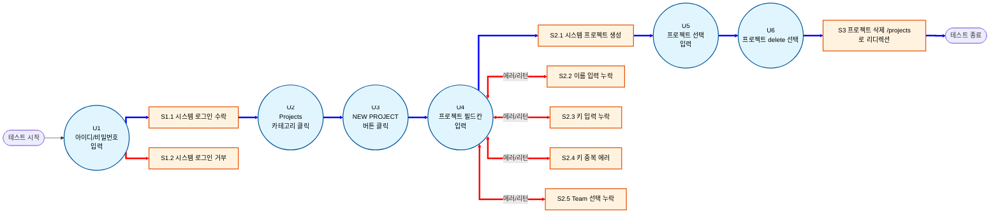

윈도우
.\venv\Scripts\Activate.ps1
맥
source .venv/bin/activate
가상환경 활성화

repomix .
repomix . -o repomix_packaging\repomix-output.xml
llm 패키징

python3 -m pytest tests/test_auth.py --headed --slowmo 500 -s


환경설정
pip3 install -r requirements.txt

최신 YOLO 패키지 설치
pip install ultralytics
데이터 학습
yolo task=detect mode=train model=yolov8n.pt data=data.yaml epochs=100 imgsz=1024 device=0 batch=4 workers=0 exist_ok=True
해결한 점
해결 못한 문제
개발 방법

## 📁 파일 구조
```
📦 프로젝트 루트
├── 📄 data.yaml                  # YOLO 학습 데이터셋 설정 (9개 클래스)
├── 📄 Dockerfile                 # Docker 이미지 빌드 (CPU 최적화)
├── 📄 pytest.ini                 # pytest 실행 설정
├── 📄 requirements.txt           # Python 패키지 목록
│
├── 📁 .github/workflows/
│   └── e2e-test.yml              # GitHub Actions CI/CD 파이프라인
│
├── 📁 pages/                     # Page Object Model (POM)
│   ├── base_page.py              # 공통 기반 — AIHealer click/fill 연결
│   ├── dashboard_page.py         # 대시보드 (유저 메뉴, 로그아웃)
│   ├── issue_page.py             # 이슈 생성
│   ├── kanban_page.py            # 칸반 드래그 앤 드롭
│   ├── login_page.py             # 로그인 / API 토큰 인증
│   ├── profile_page.py           # 프로필 수정
│   ├── project_page.py           # 프로젝트 생성
│   ├── sprint_page.py            # 스프린트 생성
│   └── team_page.py              # 팀 생성
│
├── 📁 tests/
│   ├── conftest.py               # 공용 픽스처 (브라우저 설정, API 인증 컨텍스트)
│   ├── data_collect.py           # YOLO 학습용 라벨 데이터 자동 수집
│   └── 📁 playwright/
│       ├── test_auth.py          # TC1~3: 로그인 성공 / API 로그인 / 로그아웃
│       ├── test_issue.py         # TC4: 이슈 생성
│       ├── test_kanban.py        # TC5: 칸반 드래그 앤 드롭
│       ├── test_profile.py       # TC6: 프로필 수정
│       ├── test_project.py       # TC7: 프로젝트 생성
│       ├── test_sprint.py        # TC8: 스프린트 생성
│       └── test_team.py          # TC9: 팀 생성
│
├── 📁 utils/                     # AI 핵심 엔진
│   ├── best.onnx                 # 학습된 YOLO 모델 (CPU 최적화 ONNX 포맷)
│   ├── yolo.py                   # YOLOEngine 싱글톤 — UI 객체 탐지
│   ├── nlp.py                    # NLPEngine 싱글톤 — 의미 유사도 추론
│   ├── healer.py                 # AIHealer — 자가 복구 메인 로직
│   └── labeler.py                # AutoLabeler — 학습 데이터 자동 라벨링
│
├── 📁 media/                     # 스크린샷 및 디버그 이미지 샘플
└── 📁 testim/healing/            # 자가 복구 시 자동 생성되는 힐링 이미지
```

### TC 프로젝트 생성 기능의 이벤트 흐름 다이어그램



