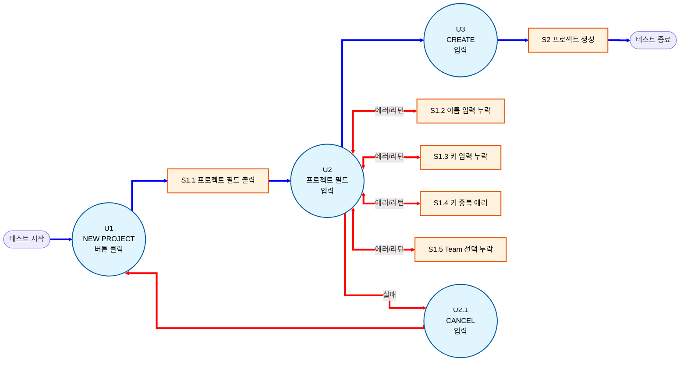

윈도우
.\venv\Scripts\Activate.ps1
맥
source .venv/bin/activate
가상환경 활성화

repomix .
repomix . -o repomix_packaging\repomix-output.xml
llm 패키징

python3 -m pytest tests/test_auth.py --headed --slowmo 500 -s


환경설정
pip3 install -r requirements.txt

최신 YOLO 패키지 설치
pip install ultralytics
데이터 학습
yolo task=detect mode=train model=yolov8n.pt data=data.yaml epochs=100 imgsz=1024 device=0 batch=4 workers=0 exist_ok=True
해결한 점
해결 못한 문제
개발 방법
ISO 29119-4

## 📁 파일 구조
```
📦 프로젝트 루트
├── 📄 data.yaml                  # YOLO 학습 데이터셋 설정 (9개 클래스)
├── 📄 Dockerfile                 # Docker 이미지 빌드 (CPU 최적화)
├── 📄 pytest.ini                 # pytest 실행 설정
├── 📄 requirements.txt           # Python 패키지 목록
│
├── 📁 .github/workflows/
│   └── e2e-test.yml              # GitHub Actions CI/CD 파이프라인
│
├── 📁 pages/                     # Page Object Model (POM)
│   ├── base_page.py              # 공통 기반 — AIHealer click/fill 연결
│   ├── dashboard_page.py         # 대시보드 (유저 메뉴, 로그아웃)
│   ├── issue_page.py             # 이슈 생성
│   ├── kanban_page.py            # 칸반 드래그 앤 드롭
│   ├── login_page.py             # 로그인 / API 토큰 인증
│   ├── profile_page.py           # 프로필 수정
│   ├── project_page.py           # 프로젝트 생성
│   ├── sprint_page.py            # 스프린트 생성
│   └── team_page.py              # 팀 생성
│
├── 📁 tests/
│   ├── conftest.py               # 공용 픽스처 (브라우저 설정, API 인증 컨텍스트)
│   ├── data_collect.py           # YOLO 학습용 라벨 데이터 자동 수집
│   └── 📁 playwright/
│       ├── test_auth.py          # TC1~3: 로그인 성공 / API 로그인 / 로그아웃
│       ├── test_issue.py         # TC4: 이슈 생성
│       ├── test_kanban.py        # TC5: 칸반 드래그 앤 드롭
│       ├── test_profile.py       # TC6: 프로필 수정
│       ├── test_project.py       # TC7: 프로젝트 생성
│       ├── test_sprint.py        # TC8: 스프린트 생성
│       └── test_team.py          # TC9: 팀 생성
│
├── 📁 utils/                     # AI 핵심 엔진
│   ├── best.onnx                 # 학습된 YOLO 모델 (CPU 최적화 ONNX 포맷)
│   ├── yolo.py                   # YOLOEngine 싱글톤 — UI 객체 탐지
│   ├── nlp.py                    # NLPEngine 싱글톤 — 의미 유사도 추론
│   ├── healer.py                 # AIHealer — 자가 복구 메인 로직
│   └── labeler.py                # AutoLabeler — 학습 데이터 자동 라벨링
│
├── 📁 media/                     # 스크린샷 및 디버그 이미지 샘플
└── 📁 testim/healing/            # 자가 복구 시 자동 생성되는 힐링 이미지
```
명세
ERP 일부 기능인 프로젝트 생성 이라는 테스트 항목이 있고 테스트 베이시스는 다음과 같다.
프로젝트 생성 기능은 사용자가 관리할 프로젝트를 생성하도록 해 준다. 프로젝트 생성은 
프로젝트 필드에서 프로젝트 생성 버튼을 누른 뒤 프로젝트 필드 칸을 채운다.프로젝트 필드로는 프로젝트 이름,프로젝트 키,프로젝트 설명, 상태,팀,시작-종료일,배포 URL을 설정할 수 있다.
프로젝트를 생성하면 DB에 저장되 등록된 팀은 프로젝트를 관리할 수 있다.

일반적 시나리오

-프로젝트 생성

대체 시나리오
-다음과 같은 이유로 프로젝트 생성에 실패함.

-프로젝트 이름 누락

-프로젝트 키 누락

-중복된 프로젝트 키

-팀 선택 누락

비고 프로젝트 이름은 중복가능, 배포 URL 시작-종료일,프로젝트 설명은 누락가능하다.

스텝 1 :기능 세트 식별(TD1)

FS1 = 프로젝트 생성 기능

스텝 2 : 테스트 컨디션 도출(TD2)

다음 모델의 예는 이벤트 흐름 다이어그램이다. 이 표기법에서 성공 흐름은 파란색 선으로 표시되어 있고, 테스트 시작과 종료 시점이 명시되어 있으며, 각 액션은 고유 ID가 있어 사용자(U) 시스템(S)로 지정한다.

### TC 프로젝트 생성 기능의 이벤트 흐름 다이어그램

테스트 컨디션

TC COND1 : 프로젝트 생성 성공(U1,S1.1,U2,U3,S2)

TC COND2 : 프로젝트 이름 누락(U1,S1.1,U2,S1.2)

TC COND3 : 프로젝트 키 누락(U1,S1.1,U2,S1.3)

TC COND4 : 프로젝트 키 중복(U1,S1.1,U2,S1.4)

TC COND5 : 팀 선택 누락(U1,S1.1,U2,S1.5)

TC COND6 : CANCEL 선택(U1,S1.1,U2,U2.1)

TC COND7 : CREATE 선택(U1,S1.1,U2,U3)

스텝 3 : 테스트 커버리지 항목 도출(TD3)

TC COVER1 = TC COND1

TC COVER2 = TC COND2

TC COVER3 = TC COND3

TC COVER4 = TC COND4

TC COVER5 = TC COND5

TC COVER6 = TC COND6

TC COVER7 = TC COND7

스텝 4 : 테스트 케이스 도출(TD4)
