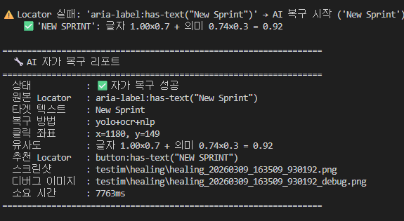

# ERP — AI E2E 테스트 자동화
ISO 29119 국제표준 테스팅을 기반으로 테스트 케이스를 설계하고 playwright로 자동화 테스트를 설계하였습니다.

추가로 Playwright Locator가 실패해도 **YOLO + OCR + NLP** 세 가지 AI 엔진이 화면을 직접 보고
스스로 UI 요소를 찾아 복구하는 E2E 테스트입니다.

기술 기반은 QA SaaS 프로그램인 Testim, Mabl, Functionize 등의 Self-Healing의 일부 기능을 구현해보고자 제작하였습니다.

---

##  목차

- [프로젝트 개요](#프로젝트-개요)
- [테스트 명세](#테스트-명세)
- [기술 스택](#기술-스택)
- [디버깅 이미지](#디버깅-이미지)
- [문제 해결 과정](#문제-해결-과정)
- [실행 방법](#실행-방법)

---

##  프로젝트 개요

| 항목 | 내용 |
|------|------|
| **테스트 케이스** | [프로젝트 시나리오 테스트](./docs/scenario_test.md), [칸반 상태전이 테스트](./docs/State_Transition_Test.md) |
| **테스트 대상** | https://erp-sut.vercel.app (팀 프로젝트 ERP 웹 애플리케이션) |
| **테스트 프레임워크** | Playwright + pytest |
| **AI 엔진** | YOLOv8 (객체 탐지) + EasyOCR (텍스트 인식) + SentenceTransformer (의미 유사도) |
| **실행 환경** | Docker / GitHub Actions |

**주요 기능**
- 로그인 API + OpenAPI Swagger 기반 사전 데이터 셋업 (POST/DELETE)
- team, project, sprint 등 E2E 테스트
- 칸반보드 드래그 엔 드롭 테스트
- 모킹 api response, request 테스트
- Locator 실패 시 AI 자가 복구 (YOLO 탐지 → OCR 텍스트 추출 → NLP 유사도 계산 → 좌표 클릭)
- 복구 리포트 자동 생성

> **참고**: **YOLO, OCR, NLP 통합 로직 구현은 LLM의 도움을 받아 진행**하였습니다.
[프로젝트 회고](./docs/retrospect.md)
---
### 리포트 출력 예시





---

##  테스트 명세

ISO 29119 국제표준 테스팅 기법을 참고하여 테스트 케이스를 설계하였습니다.
- 동등분할 + 경계값 분석으로 칸반보드 상태전이 TC를 **90% 감소**하면서 동일 커버리지 확보

| 기능 | 문서 |
|---|---|
| 프로젝트 생성 시나리오 테스트 | [project 시나리오 테스트](./docs/scenario_test.md) |
| 칸반보드 상태전이 테스트 | [kanban 상태전이 테스트](./docs/State_Transition_Test.md) |


---

## 기술 스택

**테스트 자동화**  
> Playwright, pytest, Faker  

1. conftest.py로 전역 API 픽스처 구축
2. kanban board 드래그 엔 드롭 
3. API MOKING으로 response, request 구현
4. API의 POST, DELETE, GET을 사용해 사전 데이터 셋업

**AI 엔진**  
> YOLOv8 (객체 탐지)  
> EasyOCR (광학 문자 인식)  
> SentenceTransformer (의미 기반 NLP)  
> OpenCV, ONNX Runtime  

1. locator 방식을 전부 실패했을 시 75%의 복구 성공율
2. 평균 복구 소요 시간 : 약 7.2초 
3. 실패원인 : 미탐지 3회/ 임계값 미달 1회


**인프라**  
- Docker, GitHub Actions

---

#### [성공]
- 노랑색 바운딩 박스중 가장 높은 (0.92)값을 타켓으로 지정해 초록색 중앙 좌표를 찍은 뒤 클릭하는 과정

#### [실패]
- 노랑색 바운딩 박스중 faker 라이브러리로 랜덤 생성된 텍스트 "GVKD"가 가장 높은 (0.49)값을 타켓으로 지정해 프로젝트 목록중 "GVKD"프로젝트를 지정하는것이 아닌 GRID를 눌러 실패한 장면


---
## 문제 해결 과정

### 1. Playwright — 상태 전이 구조와 하이브리드 테스트
ERP의 의존 관계(팀 → 프로젝트 → 스프린트)를 고려해  
**API POST로 사전 데이터 생성 → Playwright 테스트 수행 → API DELETE로 정리**하는 방식으로 테스트 유연성과 안정성을 높였습니다.

### 2. YOLO 모델 학습
UI 요소 탐지 학습에 필요한 100~300장의 데이터 수집 설계를 다음과 같이 진행하였습니다.
- Playwright `boundingBox()`를 활용해 자동 라벨링 데이터 수집  
- Windows / macOS 환경 + 다양한 해상도 데이터로 다양성 확보  
- ONNX Runtime으로 CPU 추론 최적화  

**학습 결과 (mAP@0.5)**

| 클래스          | AP     | 평가   |
|----------------|--------|--------|
| input          | 0.994  | 🟢 완벽 |
| link           | 0.982  | 🟢 우수 |
| button         | 0.887  | 🟢 양호 |
| avatar         | 0.799  | 🟡 보통 |
| **전체 mAP@0.5** | **0.748** | |

---

##  실행 방법

Docker desktop이 필요합니다.

### 1. .env 파일 생성

```env
BASE_URL=https://erp-sut.vercel.app/
API_URL=https://erp-backend-api-ww9v.onrender.com/
ADMIN_EMAIL=test@test.com
ADMIN_PASS=devpassword
```

### 2. Docker 빌드 및 실행

#### 이미지 빌드 최초 1회, EasyOCR 모델 다운로드(와이파이 환경에서 20분이상 소요)
```bash
docker build -t devflow-e2e .
```
전체 테스트 실행
```bash
docker run --rm --env-file .env devflow-e2e python -m pytest tests/playwright/ -s -v --browser chromium
```

> Render 무료 플랜 특성상 서버 최초 부팅에 시간이 걸릴 수 있습니다.


