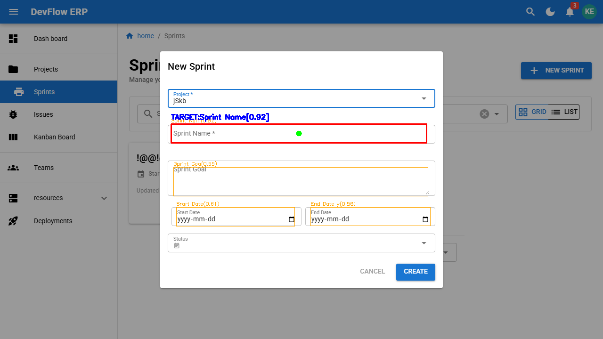
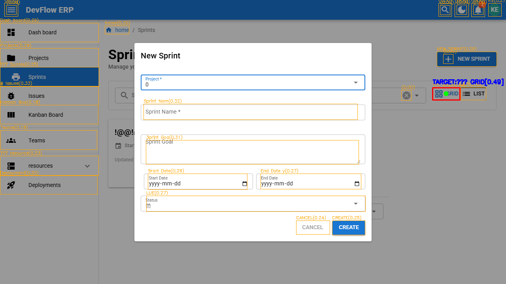

# ERP — AI E2E 테스트 자동화
ISO 29119-4 기반 시나리오 테스팅을 기반으로 테스트 케이스를 설계하고 playwright로 자동화 테스트를 설계하였습니다.

또한 Playwright Locator가 실패해도 **YOLO + OCR + NLP** 세 가지 AI 엔진이 화면을 직접 보고
스스로 UI 요소를 찾아 복구하는 E2E 테스트 프레임워크입니다.

기술 기반은 QA SaaS 프로그램인 Testim, Mabl, Functionize 등의 Self-Healing의 일부 기능을 구현해보고자 제작하였습니다.

---

##  목차

- [프로젝트 개요](#프로젝트-개요)
- [테스트 명세](#테스트-명세)
- [기술 스택](#기술-스택)
- [디버깅 이미지](#디버깅-이미지)
- [설계 단계](#설계-단계)
- [문제 해결 과정](#문제-해결-과정)
- [아키텍처](#아키텍처)
- [임계값 고찰](#임계값-고찰)
- [개발 배경 및 과정](#개발-배경-및-과정)
- [파일 구조](#파일-구조)
- [실행 방법](#실행-방법)

---

##  프로젝트 개요

| 항목 | 내용 |
|---|---|
| **테스트 케이스** | [project 시나리오 테스트](./docs/scenario_test.md) , [kanban 상태전이 테스트](./docs/State_Transition_Test.md) |
| **테스트 대상** | https://erp-sut.vercel.app //팀 프로젝트로 개발한 ERP 웹 어플리케이션(실행 방법 카테고리에 아이디와 비밀번호 있습니다.) 첫 실행하는데 1-2분 소요 사이트 종료 후 재실행이 필요할 수도있습니다. |
| **테스트 프레임워크** | Playwright + pytest |
| **프로젝트 흐름** | 명세서 및 시나리오 TC 작성 -> playwright  locator 기반 테스트 -> api로 사전 셋업 -> AI 엔진 -> 리포트 |
| **AI 엔진** | YOLOv8 (객체 탐지) + EasyOCR (텍스트 인식) + SentenceTransformer (의미 추론) |
| **실행 환경** | Docker / GitHub Actions |

상용 Self-Healing 동작 방식은 다음과 같습니다.
1. Locator 실패 감지
2. AI가 새로운 Locator 탐색
3. 새 Locator를 코드에 자동 업데이트
4. 다음 실행부터 새 Locator 사용

이 프로젝트는 일부 동작 방식을 차용해 Locator 실패 시 스크린샷을 촬영하고, 학습된 YOLO 모델로 UI 요소를 식별한 뒤 OCR로 요소 안의 텍스트를 추출합니다. 

추출된 텍스트를 NLP로 기존 목표 텍스트와 비교하여 가장 유사도가 높은 요소의 좌표를 클릭합니다. 

틀린 locator를 로그로 보여줍니다. 즉 1,2단계의 기능을 구현하고 수정방법을 제시합니다.

Playwright 코드는 자동화에 대한 이해도를 높이고자 공식 문서로 개발하였습니다. AI 엔진(YOLO/OCR/NLP) 코드 구현은 LLM의 도움을 받아 진행하였으며, 임계값 설정 및 학습 데이터 정제 과정은 공식 문서를 통해 직접 학습하고 적용하였습니다.

---
### 리포트 출력 예시

```
=================================================================
  🔧 AI 자가 복구 리포트
=================================================================
  상태           : ✅ 자가 복구 성공
  원본 Locator   : button:has-text("New Project")
  타겟 텍스트    : New Project
  복구 방법      : yolo+ocr+nlp
  클릭 좌표      : x=842, y=134
  유사도         : 글자 0.95×0.4 + 의미 0.98×0.6 = 0.97
  추천 Locator   : button:has-text("New Project")
  스크린샷       : testim/healing/healing_20260305_001021.png
  소요 시간      : 1823ms
=================================================================
```

---

##  테스트 명세

ISO 29119 국제표준 테스팅 기법을 참고하여 테스트 케이스를 설계하였습니다.

| 기능 | 문서 |
|---|---|
| 프로젝트 생성 시나리오 테스트 | [project 시나리오 테스트](./docs/scenario_test.md) |
| 칸반보드 상태전이 테스트 | [kanban 상태전이 테스트](./docs/State_Transition_Test.md) |

### 주요 문제 해결점

---
칸반보드 명세를 작성하며 이동 경우의 수가 20~ TC가 요구되어 동등분할/경계값 분석을 통해 테스트 케이스를 90% 줄이면서 동등한 커버리지를 확보하였습니다.

동등분할 & 경계값 분석

전체 이동 경우의 수 = { -5, -4, -3, -2, -1, 0, +1, +2, +3, +4, +5 }

{ +1 } = TC1, 2, 3, 4, 5

{ -1 } = TC6, 7, 8, 9, 10

{ -2, -3, -4, -5, +2, +3, +4, +5 }

건너뛰기는 정방향/역방향에 관계없이 기대 결과가 동일하게 '차단'이므로, 이동 칸 수를 기준으로 동일한 동등 클래스로 간주합니다.

따라서 경계값은 최소 이동 칸 수(2)와 최대 이동 칸 수(5)를 대표값으로 선정하였습니다.

동등분할 { -2, -3, -4, -5 } == { +2, +3, +4, +5 }

최소 경계값 { +2 } = TC11

최대 경계값 { +5 } = TC12

---

##  기술 스택

### 테스트 자동화 

| 기술 | 용도 |
|---|---|
| Playwright | E2E 브라우저 자동화 메인 프레임워크 |
| pytest | 테스트 실행 및 관리 프레임워크 |
| Faker | 테스트 데이터 랜덤 생성 |

### AI 엔진

| 기술 | 설명 |
|---|---|
| YOLO (You Only Look Once) | 객체 탐지 AI 모델. CCTV 교통 흐름이나 사람/차량 인식에 사용되는 모델을 UI 요소 탐지에 적용 |
| OCR (Optical Character Recognition) | 광학 문자 인식. 화면상 텍스트를 인식해 데이터로 변환 |
| NLP (Natural Language Processing) | 자연어 처리. ChatGPT, Gemini 등 LLM의 기반 기술로 텍스트 의미 유사도 계산에 활용 |
| OpenCV | 이미지 처리 및 디버그 시각화 |
| ONNX Runtime | YOLO 모델 CPU 추론 최적화 |

### 인프라 / DevOps

| 기술 | 용도 |
|---|---|
| Docker | 테스트 실행 환경 컨테이너화 |
| GitHub Actions | CI/CD 파이프라인 병렬 자동화 |

---
##  디버깅 이미지
#### [성공]
- 노랑색 바운딩 박스중 가장 높은 (0.92)값을 타켓으로 지정해 초록색 중앙 좌표를 찍은 뒤 클릭하는 과정

#### [실패]
- 노랑색 바운딩 박스중 faker 라이브러리로 랜덤 생성된 텍스트 "GVKD"가 가장 높은 (0.49)값을 타켓으로 지정해 프로젝트 목록중 "GVKD"프로젝트를 지정하는것이 아닌 GRID를 눌러 실패한 장면


---
##  설계 단계

### 1. 싱글톤 패턴 적용

Self-Healing에 사용되는 AI 모델의 합산 용량은 약 1GB입니다. 테스트마다 모델을 불러오는 것은 시간소모가 크며, 자동화 테스트에서 실행 시간은 중요한 요소라고 생각되어 세 엔진(YOLO, OCR, NLP) 모두 세션 내 한번만 실행됩니다.


### 2. 모델 선택 이유

목표는 사람이 눈으로 화면을 보고 테스트하는 방식을 AI로 구현하는 것입니다.

```
Playwright .screenshot()
        │
        ▼
YOLO — 스크린샷 안의 input, button, label, avatar 등을 탐지하고
       각 요소의 바운딩 박스와 중앙 좌표를 계산
        │
        ▼
OCR  — YOLO가 탐지한 각 요소 영역 안의 텍스트를 추출
        │
        ▼
NLP  — OCR로 추출한 텍스트와 pages에서 입력한 목표 텍스트의 유사도를 계산
       7 × 글자 유사도 + 0.3 × 의미 유사도 = 최종 점수
       임계값(0.336) 초과 시 해당 요소의 좌표를 Playwright에 전달하여 클릭
```

---

##  문제 해결 과정

### Playwright — 상태 전이 구조와 하이브리드 테스트 방식

ERP는 기본적인 상태 전이 구조를 가지고 있습니다.

```
팀 생성 → 프로젝트 생성(팀 필요) → 스프린트 생성(팀+프로젝트 필요)
```

처음에는 팀, 프로젝트 등을 미리 생성해두고 하드코딩으로 테스트를 진행하였습니다. 하지만 완성도가 떨어지고 테스트가 유연하지 못하다고 판단하여 아래와 같은 하이브리드 방식으로 전환하였습니다.

```
API_POST (팀/프로젝트 사전 생성)
        │
        ▼
Playwright UI 테스트 진행
        │
        ▼
API_GET (생성된 리소스 ID 조회)
        │
        ▼
API_DELETE (테스트 데이터 정리)
```

### AI — YOLO 모델 학습 개선

초기 학습된 모델은 신뢰도 0.3~0.4로 50%에도 미치지 못하였습니다. YOLO는 원래 사람, 차량, 드론 등 동적인 객체를 탐지하는 모델이라 button, input, avatar 같은 UI 데이터셋이 부족해 직접 학습시켜야 했습니다.

신뢰도를 높이기 위해 다음을 진행하였습니다.

**Windows / macOS 환경 교차 학습**
두 OS는 기본 픽셀 밀도가 달라 같은 화면이라도 서로 다른 데이터를 제공합니다. 두 환경에서 모두 데이터를 수집하여 다양성을 높였습니다.

**해상도 다양화**
테스트 실행은 항상 1280×720으로 고정해 오차를 줄이고, 학습 시에는 더 크고 작은 해상도의 데이터를 수집해 모델 품질을 향상시켰습니다.

**개선 결과**
* **AP (Average Precision)**
  * 각 클래스별(Button, Input 등) 탐지 정확도 점수(0~1)입니다. 1에 가까울수록 해당 UI 요소를 정확하게 찾아낸다는 의미입니다.
* **mAP@0.5 (mean Average Precision at IoU 0.5)**
  * 전체 클래스 AP의 평균 점수입니다. 
  * `@0.5`는 탐지 박스가 실제 정답 박스와 **50% 이상 겹쳐야(IoU 0.5 이상)** 정답으로 인정한다는 기준을 뜻합니다.


| 클래스 | AP | 평가 |
|---|---|---|
| input | 0.994 | 🟢 거의 완벽 |
| link | 0.982 | 🟢 우수 |
| button | 0.887 | 🟢 양호 |
| avatar | 0.799 | 🟡 보통 |
| dialog-button | 0.630 | 🟡 보통 |
| modal | 0.616 | 🟡 보통 |
| icon-button | 0.569 | 🔴 낮음 |
| q-select | 0.510 | 🔴 낮음 |
| **전체 mAP@0.5** | **0.748** | |

---

##  아키텍처

```
테스트 코드 (test_*.py)
        │
        ▼
   Page Object (pages/)
        │  click() / fill()
        ▼
   BasePage → AIHealer
        │
        ├─── [1차] Playwright Locator 시도
        │         성공 → 바로 반환
        │         실패 (TimeoutError) ↓
        │
        ├─── [2차] 스크린샷 촬영
        │
        ├─── YOLOEngine  → UI 요소 위치 탐지 (9개 클래스)
        ├─── OCREngine   → 각 영역 텍스트 추출
        ├─── NLPEngine   → 의미 유사도 계산
        │
        └─── 최고 점수 요소 좌표로 마우스 클릭
```

### YOLO 탐지 클래스 (9종)

| ID | 클래스 | 설명 |
|---|---|---|
| 0 | button | 일반 버튼 |
| 1 | input | 텍스트 입력창 |
| 2 | link | 앵커/링크 |
| 3 | avatar | 프로필 아바타 버튼 |
| 4 | q-select | 드롭다운 셀렉트 |
| 5 | icon-button | 아이콘 버튼 |
| 6 | modal | 모달 다이얼로그 |
| 7 | toast | 알림 토스트 |
| 8 | dialog-button | 모달 내부 버튼 |

---
## 임계값 고찰
[학습 그래프](./docs/train_graph.md)

### 단어/의미 유사도 가중치 (CHAR_WEIGHT 0.7 / SEMANTIC_WEIGHT 0.3)

로케이터마다 유사도의 중요도가 다릅니다.

Faker로 생성한 임시 팀/프로젝트 이름처럼 무작위 문자열을 구별할 때는
의미 추론이 무의미하므로 글자 유사도가 중요합니다.

반면 `CANCEL`, `CREATE` 같은 고정 UI 텍스트는 개발자가
`취소`, `되돌리기`, `revoke` 등 유사한 표현으로 변경할 수 있어
의미 유사도가 장기적으로 더 중요합니다.

현재는 팀/프로젝트 이름 탐지 실패가 빈번하고 ERP UI 변경 가능성이 낮아
글자 유사도 가중치를 높게 설정하였습니다. 다만 이 값은 데이터 부족 상태에서의
임시 최적값이며, ERP 프론트엔드를 의도적으로 변경해가며 Healing 케이스를
축적한 뒤 데이터 기반으로 재조정이 필요합니다.

---

### UI 탐지 임계값 (conf 0.6)

총 9개의 UI 클래스를 학습시켰으나 데이터 정제가 충분하지 않아
클래스별 AP 편차가 큽니다.

| 클래스 | AP |
|---|---|
| input, link | 0.98 ~ 0.99 |
| button | 0.89 |
| icon-button, q-select 등 | 0.50 ~ 0.63 |

F1-Confidence Curve 기준 전체 클래스 F1 최적점은 **0.74 at conf 0.336** 입니다.
F1은 Precision(오탐율)과 Recall(미탐율)의 균형 지표로,
conf 0.336일 때 두 지표의 균형이 가장 좋습니다.

input, link, button은 AP가 높아 conf를 0.3~0.4로 낮춰도 오탐이 적지만,
AP가 0.5~0.6대인 나머지 클래스는 conf 0.5 이하에서 오탐율이 급격히 증가합니다.
따라서 AP가 낮은 클래스의 오탐을 억제하기 위해 **conf 0.6**을 선택하였습니다.

---

### 최종 유사도 임계값 (final_s 0.5)

YOLO가 탐지한 요소 중 글자/의미 유사도 앙상블 점수가 0.5 미만이면 무효화합니다.
현재 데이터가 부족하여 Healing 발동 시 로그만으로는 최적값 도출이 어렵습니다.
ERP UI를 의도적으로 변경해가며 성공/실패 케이스를 축적한 뒤
데이터 기반으로 재조정이 필요하며, 현재는 중앙값인 0.5로 설정하였습니다.

---

##  개발 배경 및 과정

테스트용 ERP를 개발하면서 전혀 다른 섹션을 수정해도 전체적으로 테스트하는 습관이 있었습니다. 이때 테스트 자동화가 있었으면 좋겠다고 생각해 개발이 끝난 뒤 Selenium으로 자동화를 진행하였고, 이후 이번 Playwright 프로젝트를 진행하였습니다.

첫 프로젝트에서 Shadow DOM Locator와 XPath를 사용하며 계속해서 실패하는 locator을 보며 실제 사람처럼 이미지를 보고 클릭하면 좋을것 같다고 생각이 들어 이번 프로젝트에서는 YOLO를 사용한 이미지 기반 클릭 방식을 개발하고자 하였습니다. 하지만 개발을 하며 총 3번의 구조 변경이 있었습니다.


### 1단계 — Selector 없이 사람처럼 클릭하는 테스트

처음엔 YOLO와 OpenCV를 사용해 사람처럼 화면을 보고 클릭하는 방식으로 구현하려고 했습니다.

하지만 개발 중 "개발자가 의도하지 않은 방식이지만, UI에 보인다는 이유만으로 성공 처리가 되면 안되지 않을까?"라는 의문이 생겼습니다.

자동화 테스트의 목적은 성공적인 기능 동작이 아닌 테스트 케이스에 맞춰 정확하게 검증하는 것이라는 방향으로 생각이 정리되었습니다.

### 2단계 — SSIM + YOLO를 활용한 UI/UX 테스트

테스트 대상 ERP에 다크모드 시 글자가 보이지 않는 버그가 있었습니다. 이를 테스트하기 위해 SSIM으로 픽셀의 명암비 손실을 비교하여 보이지 않는 글자를 검출해내는 로직과 YOLO로 UI 요소가 실제로 화면에 보이는지 검증하는 방식으로 전환하였습니다.

하지만 개발 도중 Playwright에 내장된 `pixelmatch` 기능을 알게 되었고 복잡하고 무서운 AI 기능을 사용할 필요 없이 더 쉽고 빠르게 오류를 찾을 수 있기에 구현을 포기하였습니다.

이미 검증된 기능이 있다면 그것을 활용하는 것이 더 나은 선택이라고 판단했습니다.

### 3단계 — Self-Healing으로 전환 (현재)

Testim, Healenium 등 이미 상용화된 Self-Healing SaaS를 참고하여 직접 구현하는 것을 목표로 하였습니다. Playwright Locator가 실패하더라도 YOLO + OCR + NLP로 스스로 UI 요소를 찾아 복구하는 방식입니다. 지금까지 진행하며 배운 내용으로 제작하기 가장 적합하다고 판단했습니다.

---
### 제작 과정
대학 시절 딥러닝 과목을 흥미롭게 들었던 기억과 Selenium 자동화 테스트를
진행하며 TensorFlow와 NumPy를 사용해 이미지를 학습시킨 경험을 바탕으로,
LLM API 없이 이미지 인식만으로 자동화 시스템을 만들 수 있을 것이라
생각했습니다.

자료 조사를 하며 YOLO와 OpenCV를 알게 되었고 개발을 진행하던 중
개인 역량의 한계를 느꼈습니다. YOLO와 Playwright를 접목하려면
두 라이브러리 모두에 중급 이상의 지식이 필요했고, YOLO가 출력하는
정규화 좌표(0~1)를 Playwright 픽셀 좌표로 역변환하는 수학적 처리,
다중 객체 탐지를 위한 앙상블 기법, SSIM 구조적 유사도 공식 등 전반적인 이해가 필요했습니다.

하지만 제 역량은 데이터 학습 그래프를 보고 통과 수치를 조정하거나
높은 인식률을 위해 데이터 전처리 과정 수준이라 판단되어
Healing 엔진은 바이브 코딩으로 진행하였습니다.

다만 Playwright는 공식 문서만으로 개발하였고, Playwright와 Healing
엔진을 연결하는 과정과 엔진 코드를 한 줄씩 읽으며 리팩토링하는 과정을
통해 YOLO → OCR → NLP 파이프라인의 동작 방식을 이해하고
AI 라이브러리 코드 리딩 능력 코드 리딩 능력을 기를 수 있었습니다.

---
##  파일 구조

```
📦 프로젝트 루트
├── 📄 data.yaml                  # YOLO 학습 데이터셋 설정 (9개 클래스)
├── 📄 Dockerfile                 # Docker 이미지 빌드 (CPU 최적화)
├── 📄 pytest.ini                 # pytest 실행 설정
├── 📄 requirements.txt           # Python 패키지 목록
│
├── 📁 .github/workflows/
│   └── e2e-test.yml              # GitHub Actions CI/CD 파이프라인
│
├── 📁 pages/                     # Page Object Model (POM)
│   ├── base_page.py              # 공통 기반 — AIHealer click/fill 연결
│   ├── dashboard_page.py         # 대시보드 (유저 메뉴, 로그아웃)
│   ├── issue_page.py             # 이슈 생성
│   ├── kanban_page.py            # 칸반 드래그 앤 드롭
│   ├── login_page.py             # 로그인 / API 토큰 인증
│   ├── profile_page.py           # 프로필 수정
│   ├── project_page.py           # 프로젝트 생성
│   ├── sprint_page.py            # 스프린트 생성
│   └── team_page.py              # 팀 생성
│
├── 📁 tests/
│   ├── conftest.py               # 공용 픽스처 (서버 부팅 대기, API 인증 컨텍스트)
│   ├── data_collect.py           # YOLO 학습용 라벨 데이터 자동 수집
│   └── 📁 playwright/
│       ├── test_auth.py          # TC1~3: 로그인 성공 / API 로그인 / 로그아웃
│       ├── test_issue.py         # TC4: 이슈 생성
│       ├── test_kanban.py        # TC5: 칸반 드래그 앤 드롭
│       ├── test_profile.py       # TC6: 프로필 수정
│       ├── test_project.py       # TC7: 프로젝트 생성
│       ├── test_sprint.py        # TC8: 스프린트 생성
│       └── test_team.py          # TC9: 팀 생성
│
├── 📁 utils/                     # AI 핵심 엔진
│   ├── best.onnx                 # 학습된 YOLO 모델 (CPU 최적화 ONNX 포맷)
│   ├── yolo.py                   # YOLOEngine 싱글톤 — UI 객체 탐지
│   ├── nlp.py                    # NLPEngine 싱글톤 — 의미 유사도 추론
│   ├── healer.py                 # AIHealer — 자가 복구 메인 로직
│   └── labeler.py                # AutoLabeler — 학습 데이터 자동 라벨링
│
└── 📁 testim/healing/            # 자가 복구 시 자동 생성되는 힐링 이미지
```

---
##  실행 방법

Docker만 있으면 바로 실행 가능합니다.

### 1. .env 파일 생성

아래 내용을 그대로 복사해서 `.env` 파일로 저장하세요.

```env
BASE_URL=https://erp-sut.vercel.app/
API_URL=https://erp-backend-api-ww9v.onrender.com/
ADMIN_EMAIL=test@test.com
ADMIN_PASS=devpassword
```

### 2. Docker 빌드 및 실행

#### 이미지 빌드 (최초 1회, EasyOCR 모델 다운로드로 시간 소요)
```bash
docker build -t devflow-e2e .
```
전체 테스트 실행
```bash
docker run --rm --env-file .env devflow-e2e python -m pytest tests/playwright/ -s -v --browser chromium
```

> Render 무료 플랜 특성상 서버 최초 부팅에 시간이 걸릴 수 있습니다.


